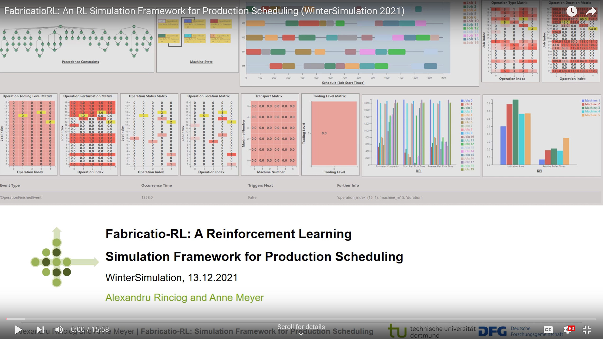
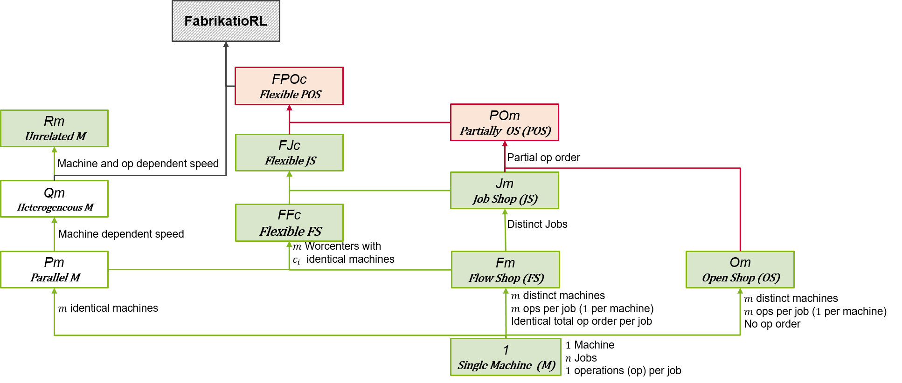
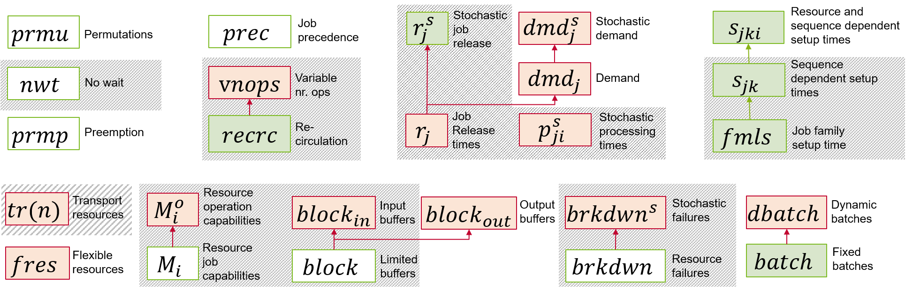
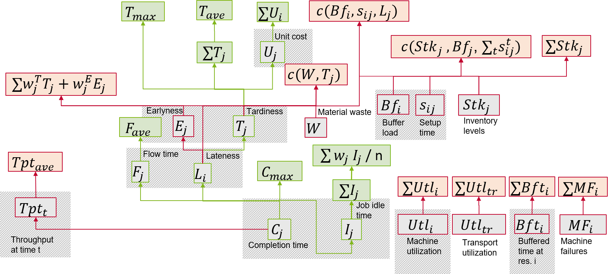
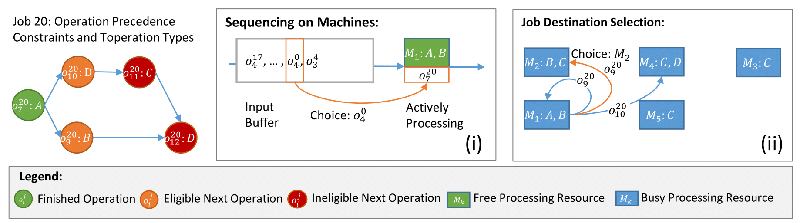
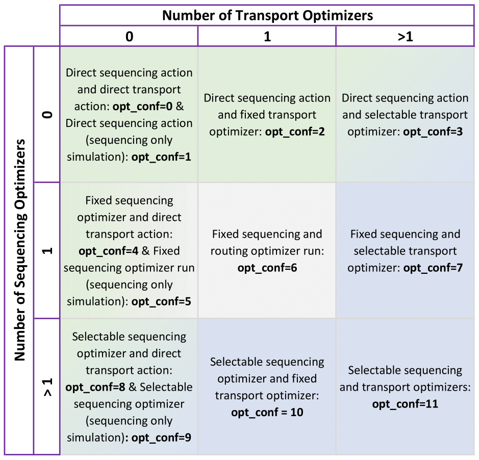
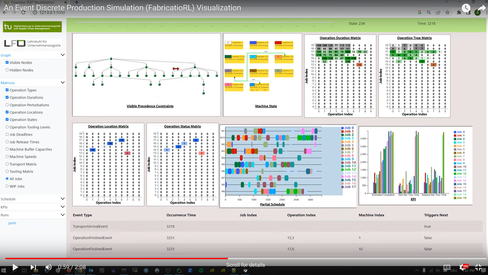

# FabricatioRL

FabrikatioRL is an reinforcement learning (RL) compatible event discrete simulation framework for production scheduling  problems implementing the [OpenAI Gym](https://gym.openai.com/) standard. As such RL agents from Libraries such as [KerasRL](https://github.com/keras-rl/keras-rl) or [Stable Baselines](https://github.com/hill-a/stable-baselines) can be tested within the realm of scheduling. 

The simulation guarantees reproducibility within stochastic scheduling setups by seeding the numpy random number generator and allows the explicit sepparation of training and test instances by means of seed sets. 

FabrikatioRL is written with extensibility in mind and is highly configurable in terms of 
1. Scheduling problem setup and
2. Markov decision process (MDP) modeling  

The following conference presentations and the associated presentations shed 
some additional light into the framework:

**Talk at CIRP CMS 2022:**
<p align="center">
<a href="https://youtu.be/fduRz48zfw4" title="Link Title"></a>
</p>

**Talk at the Winter Simulation Conference 2021:**
<p align="center">
<a href="https://youtu.be/Dy3O94YoiHo" title="Link Title"></a>
</p>>

## Features
### Setup Features
The following production scheduling problem components can be explicitly considered when instantiating the simulation (planned extensions are marked with unticked boxes):
1. Job characteristics
   - [x] Partially ordered job operations (DAG precedence constraints) 
   - [x] Variable number of operations per job
   - [x] Recurrent operation types within jobs (recirculation)
2. Resource characteristics
   - [x] Variable machine speeds
   - [x] Machine capabilities
   - [x] Machine input buffer capacities
   - [ ] Machine output buffers
   - [x] Machine dependent speeds
   - [x] Sequence dependent setup times
   - [ ] Machine and sequence dependent setup times
   - [ ] Batch processing capabilities (fixed and dynamic)
   - [x] Transport times
   - [ ] Limited number of transport resources
   - [ ] Mutiple job source and sinks
3. Stochsticity sources
   - [x] Operation duration perturbations
   - [x] Job arrival times
   - [x] Machine breakdowns (needs testing)

The following trackers are maintained for optimization goal measurement (and reward construction!) per machine or job respectively: 
1. Variables for machine-centric goals (per machine)
   - [x] Number of buffered operations
   - [x] Total processing time of buffered operations
   - [x] Machine utilization
   - [x] Total setup times overhead
2. Variables for job-centric goals (per job)
   - [x] Job completion times
   - [x] Job arrival relative flow time
   - [x] Job processing start relative flow time
   - [x] Tardiness
   - [x] Earliness
   - [x] Unit cost
   - [x] Idle time
3. Throughput variables
   - [x] Number of finished operations 
   - [x] Number of finished jobs 

Production scheduling setups are usually described using the parameters  for production setups and  for optimization goal [[1]](#1). The figures below present an overview of the parameters covered by our simulation. The images from [[2]](#2) were adapted for this purpose. There you can read more about the different setups in RL scheduling literature.

   <p align="center">
       
   </p>
   Figure 1: Machine setup () hierarchy in relationtion with FabrikatioRL. Arrows define a generalization relation. Green rectangles were introduced by Pinedo. Red rectangeles were defined in in RL scheduling literature. Filled in rectangles were experimented with in RL literature. The hatched rectangle represents our simulation.

   <p align="center">
       
   </p>
   Figure 2: Additional constraints () covered by FabrikatioRL (hatched). Arrows define a generalization relation. Green rectangles were introduced by Pinedo. Red rectangeles were defined in in RL scheduling literature. Filled in rectangles were experimented with in RL literature. Note that currently, FabrikatioRL can only simulate  environments.

   <p align="center">
       
   </p>
   Figure 3: Optimization goal () intermediary variables covered by FabrikatioRL (hatched). Arrows indicate an "is used by" relation. Green rectangles are described by Pinedo. Red rectangeles were defined in in RL scheduling literature. Filled in rectangles (red or green) were experimented with in RL literature. Boxes with gray filling represent intermediary variables.

### MDP Features
Agents are tasked with decision making (mainly) when operation processing finishes on  machines. The simulation supports the configuration of the following production scheduling MDP components:
1. Decisions
   - [x] Operation sequencing on machines (What operation is picked from the buffer?)
   - [x] Job transport (To which downstream machine is the job sent?)
   - [ ] Transport vehicle selection (Which transport resource carries the operation?)
   <p align="center">
       
   </p>
   Figure 4: Simulation decision overview.

2. Action Space: The action space configuration is dependent on the decisions present as dictated by the chosen setup and is inferred by the number of optimizer objects (either sequencing, transport) present. The simulation can completely defer a decision type to a fixed optimizer. Agent action spaces are any combination of the following:
   - [x] Direct operation sequencing (agent action is an operation index)
   - [x] Direct transport target selection (agent action is a machine index)
   - [x] Indirect operation sequencing using optimizers (agent action is a sequencing optimizer index)
   - [x] Indirect transport target selection using optimizers (agent action is a transport optimizer index)
   - [ ] Direct vehicle selection
   - [ ] Indirect vehicle selection <br/>
   The supported direct/indirect action combinations are listed in the overview below
   <p align="center">
       
   </p>
   Figure 5: Simulation mode overview. The simulation mode is configured implicitly by number and type of optimizers passed to the environment initialization function.

3. Observation space: The observation space can be configured by means of a  `ReturnTransformer` object having access to the entire state representation. Selectable information is <br/>
	* System time<br/>
	* Raw state information <br/>
		* Operation durations matrix<br/>
		* Operation types matrix<br/>
		* Operation precedence graph matrices<br/>
		* Operation location matrix <br/>
		* Operation status matrix<br/>
		* ...<br/>
	* The legal next actions<br/>
	* Trackers<br/>

4. Reward: Same configuration mechanism as with observation space

### Visualization
FabricatioRL ships with a visualization app built on Flask. Though useful for 
debugging, the visualization is still in its incipient phases. 
See the "Examples" section for an orientation on how to use it. 
Here's a peek:
<p align="center">
<a href="https://youtu.be/wn-gQOx-xd0" title="Link Title"></a>
</p>

# FabricatioControls
The `fabricatio-controls` package contained in the repository contains 
scheduling algorithms compatible with the FabricatioRL.

Schedulers based on the following approaches are contained:
- [x] Constrained Programming (built on top of `ortools`) 
- [x] Heuristics and heurisctic combinations
- [x] Monte Carlo Tree Search
- [x] DQN (built on top of `stable-baselines3`)
- [x] AlphaZero (built ontop of `tensorflow`(keras))

Some useful functionality for evaluating the contained algorithms is also 
present.

# Getting Started
For now, the latest version of `fabricatio-rl` and its controls is not made 
available through `pypi`. 
As such, to run the contained experiment and example scripts, the "manual" 
installation process below must be performed. 
Note that this project was tested with python 3.6 only. 
Other interpreter versions may lead to unexpected errors. 

### Installation
1. Clone the project to get the code locally:
```
git clone https://github.com/malerinc/fabricatio-rl.git
```
2. Navigate to the `fabricatio-rl` folder in a terminal and run
```
python setup.py install
```
3. Navigate to the `fabricatio-controls` in a terminal and run
```
python setup.py install
```

### Examples
This repository contains four simulation usage examples namely
1. A simple heuristic run on randomely sampled JSSPs
2. Training and testing a Double DQN Agent from `keras-rl` with networks defined in `keras` on stochastic dynamic JSSPs with 
	* 5 operations per job
	* 20 jobs total
	* 10 initial jobs 
	* partially ordered job operations
	* custom fixed machine capabilities
3. An example of random action selection run 
4. A demonstration of Fabricatio's logging and visualization functionality. 
The logging functionality is activated by providing the simulation framework 
with the `path` to a log directory. To visualize the logs the `flask` app 
contained the `fabricatio-rl`'s `visualization_app` module needs to be 
pointed to the same `path` on instantiation. 


To run the third example you will need to additionally install `keras-rl2`
and `tensorflow`.
to that end you should navigate to the experiments folder and execute

```
pip pip install -r requirements.txt
```

### Experiments
Understanding the experiments contained by this repository requires an in depth 
knowledge of the two packages `fabricatio-rl` and `fabricatio-controls` that.
We plan to convey this knowledge through future publications. 

To run them, simply execute the scripts contained by the `experiments` directory 
in sequence.
Note running the experiments to completion may take weeks on an average personal 
computer. 
 

# Citing the Project
If you use `FabricatioRL` in your research, you can cite it as follows:

```
@misc{rinciog2020fabricatio-rl,
    author = {Rinciog, Alexandru and Meyer Anne},
    title = {FabricatioRL-v2},
    year = {2021},
    publisher = {GitHub},
    journal = {GitHub Repository},
    howpublished = {\url{https://github.com/malerinc/fabricatio-rl.git}},
}
```

# References
<a id="1">[1]</a> Pinedo, Michael. Scheduling. Vol. 29. New York: Springer, 2012.

<a id="2">[2]</a> Rinciog, Alexandru, and Anne Meyer. "Towards Standardizing Reinforcement Learning Approaches for Stochastic Production Scheduling." arXiv preprint arXiv:2104.08196 (2021).
